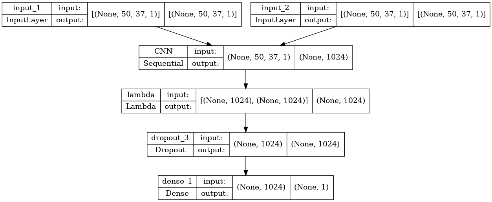
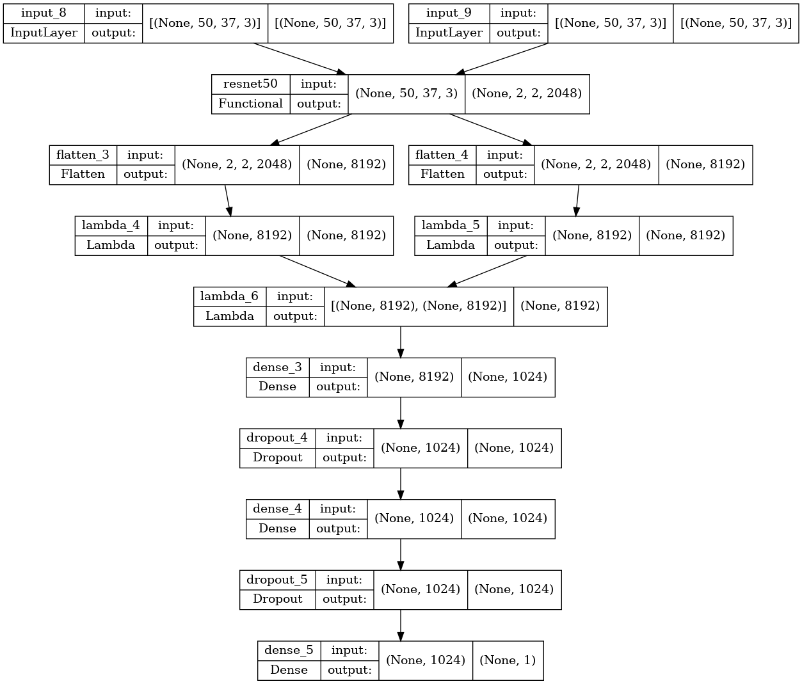

## The architecture

### **Without fine-tunning**

### **With fine-tunning**

For the fine-tunning, I replaced CNN part by ResNet50 pre-trained model.

---

## The tests:

I tested the performance results of multiple training sessions with different combinations of hyperparameters and write everything in `csv` files. The results can be used to compare the performance of different models and to identify the best hyperparameters for the task at hand.

Here is a table to resume each `.csv` file:

| Test file  | Resume | Hours of training | Conclusions | Best Validation Accuracy |
| ------------- | ------------- | ------------- | ------------- | ------------- |
| `first_tests.csv`  | Check the best parameters and combinations without fine-tunning + No data augmentation | ~24h | Low neurons dense & high dropout rate are not good | 0.647 |
| `second_tests.csv`  | Test with less pixels and default LFW slice (remove useless part of the image) without fine-tunning + Data augmentation | ~20h | Low learning rate is bad + better results | 0.694 |
| `third_tests.csv`  | Test fine-tunning with less test parameters | ~15h | Slower and not extraordinary better results | 0.714 |

*Do not hesitate to check the content of the csv files because I think there are a lot of informations that I can not summarize in the README*

TODO Insert graph of the accuracy of the best model

---

## Sources

Here are articles that inspired me and helped me during this project

* https://pyimagesearch.com/2020/11/30/siamese-networks-with-keras-tensorflow-and-deep-learning/

* https://keras.io/examples/vision/siamese_contrastive/

* https://arxiv.org/abs/1910.09798

* https://pyimagesearch.com/2021/01/18/contrastive-loss-for-siamese-networks-with-keras-and-tensorflow/

* https://github.com/nevoit/Siamese-Neural-Networks-for-One-shot-Image-Recognition/blob/HEAD/siamese_network.py#L16

* https://github.com/morkertis/One-Shot-Face-Recognition
